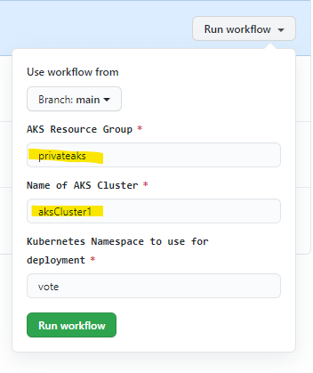

# Private AKS & GitHub runner

This repo contains two main assets:  
1) An ARM template to deploy a private private AKS cluster, a VM, and a VNET.  The VM will be used as a private GitHub runner
2) A GitHub workflow that deploys a sample voting app to the private AKS cluster

You will need to fork a copy of this repo into your own GitHub Account or Org.

## ARM Template 
The arm template creates:
- A Private AKS cluster
  - Cluster uses a system assigned identity (MSI)
- An Ubuntu server to be used as a GitHub runner.  Image is based on the Azure Data Science VM, as it already has the required tools installed.
  - VM is created with private IP only
  - GitHub Runner self hosted build server needs to be manually installed per [instructions](https://docs.github.com/en/free-pro-team@latest/actions/hosting-your-own-runners/adding-self-hosted-runners)
  - The build server has minimal tooling.  If you want to use it beyond the scope of this lab, you will likely need to install additional tools and SDKS (Eg, dotnet, java, etc)  _Optional, and not required for this lab_

- A VNET with three subnets
  - vmsubnet - for vm deployment
  - akssubnet - for aks deployment
  - AzureBastionSubnet - used if you deploy Azure Bastion service (not included in this arm template)
- A role assignment for the AKS resource granting it contributor access to the akssubnet

### Deploying the ARM Template
1. Clone the repo locally and then cd into the ARM folder.
2. In your favorite editor, edit the defaults in either the `deploy.ps1` (powershell) or the `deploy.sh` (bash). 
3. Run either the `deploy.ps1` or the `deploy.sh` to deploy the resources to Azure.  When this script runs for the first time, it will create an ssh key to be used with the deployment, and will ask for a passphrase.  You can just press 'return' to leave the passphrase blank.  At the end of the script it will create a service principal.   **Be sure to take note of the Service Principal that is created!**
4. Once the script finishes, you will need to manually create an [Azure Bastion Service](https://docs.microsoft.com/en-us/azure/bastion/tutorial-create-host-portal) and attach it to the VNET that was just created.
5. Once the Baston Service has been created, use it to ssh into the VM using the `akslabkey` ssh key that was created earlier. NOTE:  by default, the username is _azureuser_; this is a parameter in the ARM template if you want to change it.
6. Install the Self Hosted GitHub Runner agent by following the steps on [this page](https://docs.github.com/en/free-pro-team@latest/actions/hosting-your-own-runners/adding-self-hosted-runners)
   - Follow the steps to described on the install page add a self-hosted agent to a repository
   - Addtionally, you must configure the agent to run as a service:  https://docs.github.com/en/free-pro-team@latest/actions/hosting-your-own-runners/configuring-the-self-hosted-runner-application-as-a-service
 

## APP:  Deploy simple app to AKS cluster
Once the runner has been configured, you can use the included workflow to deploy an app to the private cluster through the following steps:

1. Within your GitHub repo, create a Secret called AZURE_AKS_CREDENTIALS, and use the service principal json created earlier as the value of that secret.
2. To run the workflow, browse to 'Actions', select the 'DeployToAKS' workflow, and then select the 'Run Workflow' button to manually run this workflow.<p>
If you've changed the default resource group or aks cluster name, you will need to override the defaults when you run the workflow:
<p>
Alternatively, you you can edit defaults found in the workflow file `deployapp.yml`
```yaml
      AZURE_AKS_RG: 
        description: 'AKS Resource Group'
        default: 'privateaks' # edit this if needed
        required: true
      AZURE_AKS_NAME: 
        description: 'Name of AKS Cluster'
        default: 'aksCluster1' # edit this if needed
        required: true
```
3. The workflow will deploy the sample app to the cluster.  You can test this by running the following from a command line on the build server:
```bash
# you will first need to run 'az login' if you haven't done so already
az aks get-credentials -n <AKSCLUSTERNAME> -g <RESOURCEGROUPNAME>  # one time only
kubectl get all --namespace vote
```
